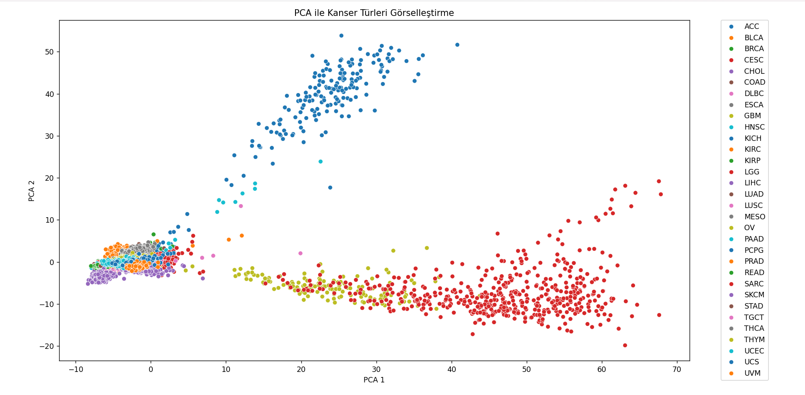

# 🧬 Multi-Class Classification of Cancer Types using TCGA Pan-Cancer RNA-Seq Data


This repository contains a high-performance bioinformatics pipeline for classifying 33 different cancer types using high-dimensional genomic data. The project is based on the research and technical paper authored by **Sümeyye Bakırdal**.

---

## 📄 Technical Paper (Original in Turkish)
The full research paper is available in this repository: `Technical_Paper_Cancer_Classification.pdf`.

> **Note:** While the full paper is in Turkish, the methodology, dataset details, and experimental results are summarized below in English for international review.

---

## 📂 Dataset & Source
This research utilizes the standardized **TCGA (The Cancer Genome Atlas) Pan-Cancer Atlas** datasets. 

### 1. Genomic Data (RNA-Seq)
* **File Name:** `EBPlusPlusAdjustPANCAN_IlluminaHiSeq_RNASeqV2.geneExp.tsv`
* **Description:** This is the "final freeze" batch-corrected mRNA expression profile. The "EBPlusPlusAdjust" method was used to remove technical variations (batch effects) across different sequencing centers, ensuring high data quality for Machine Learning.

### 2. Clinical Metadata (TCGA-CDR)
* **File Name:** `TCGA-CDR-SupplementalTableS1.xlsx`
* **Description:** The Clinical Data Resource (CDR) file used to map patient barcodes to specific cancer types (e.g., BRCA, LUAD, GBM).

---

## 🛠️ Methodology
The pipeline implements a rigorous bioinformatics workflow:
* **Preprocessing:** Log-transformation and standard scaling of gene expression levels.
* **Feature Selection:** * **Variance Thresholding:** To remove low-variance genes.
  * **SelectKBest (ANOVA F-test):** Statistical selection of the top 500 most discriminative genes.
* **Dimensionality Reduction:** **PCA** was used for high-dimensional data visualization and cluster analysis.
* **Benchmarking:** Comparative study of Logistic Regression, Random Forest, SVM, and Neural Networks (MLP).

---

## 📊 Key Results
* **Best Performing Model:** Logistic Regression
* **Validation Accuracy:** **94.6%** (via 5-fold cross-validation).
* **Finding:** Molecular signatures from RNA-Seq data provide highly accurate markers for cancer type differentiation.

---
## 📊 Experimental Results

The training performance was monitored through accuracy and loss curves. The graph below illustrates the model's convergence over 10 epochs:



As seen in the results, the model achieved high precision...

---

## 🚀 Getting Started & How to Run

### 1. Download the Dataset
The datasets are too large to be hosted on GitHub. You can download the required files from the official **NCI Genomic Data Commons (GDC)** portal:
👉 **[Download TCGA Pan-Cancer Atlas Data Here](https://gdc.cancer.gov/about-data/publications/pancanatlas)**

*Please ensure the `.tsv` and `.xlsx` files are placed in the same directory as the script.*

### 2. Prerequisites
Install the required Python libraries:
```bash
pip install pandas numpy scikit-learn seaborn matplotlib openpyxl
